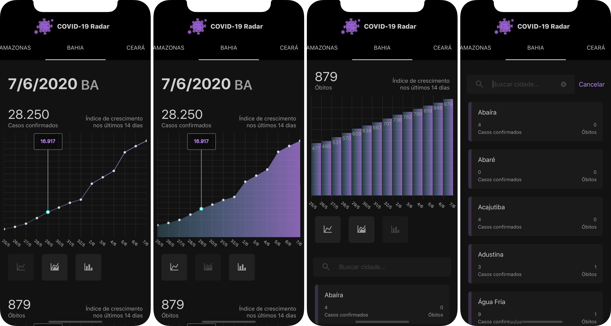
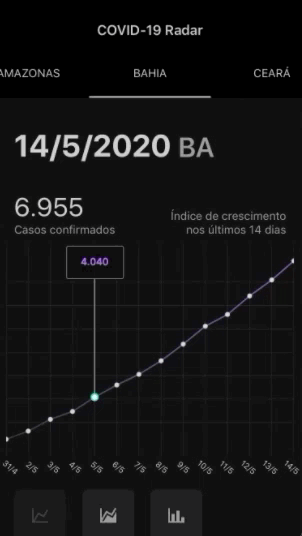

<h4>JavaScrip | React Native</h4>

COVID-19 Radar is a monitoring app illustrated by indicators and graphs. It follows the updated and accumulated growth of confirmed cases and deaths caused by the Coronavirus in each state and city in Brazil.
</>
    
 
 
     

