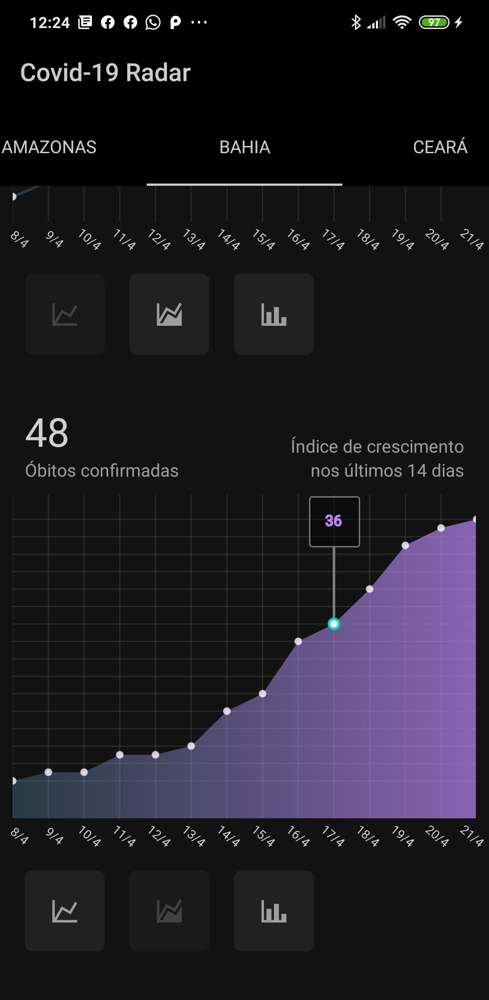

<h1>Covid-19 Radar</h1>
<h4>JavaScrip | React Native</h4>

O Covid-19 Radar é um app de monitoramento ilustrado por indicadores e gráficos. Ele acompanha o crescimento atualizado e acumulado de casos confirmados e óbitos causados pelo Coronavírus em cada Estado do Brasil.</>

     
     
     

